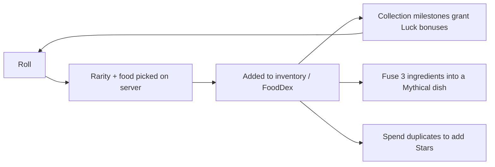

# 🍜 Food RNG (`cat-rng`)

A Roblox **food-collecting RNG game** written in Luau. Players roll for dishes from around the world, fill out a cookbook, fuse ingredients into Mythical recipes, and star-upgrade duplicates — all while stacking luck bonuses that make rare rolls more likely.

## Core Game Loop



1. **Roll** – click to roll; the server picks a rarity, then a food of that rarity.
2. **Collect** – new foods grow your *FoodDex* and unlock permanent luck bonuses.
3. **Fuse** – combine specific foods (e.g. `Gimbap | Onigiri | White Rice`) into a Mythical fusion dish.
4. **Upgrade** – spend duplicate copies to raise a food's star level.
5. **Fast Roll** – a per-player setting that skips the roll animation.

---

## Tech Stack & Architecture

| Concern | Tool |
| --- | --- |
| Project sync | [Rojo](https://rojo.space) 7.5.1 (`default.project.json`) |
| Toolchain manager | Aftman (`aftman.toml`) / Rokit (`rokit.toml`) |
| Packages | [Wally](https://wally.run) (`wally.toml`) — `Trove`, `Observers`, `t` |
| Linting | Selene (`selene.toml`, `std = "roblox"`) |
| Data storage | Plain `DataStoreService` (`GetAsync` / `SetAsync`) |
| Architecture | Custom ModuleScripts (no Knit / ProfileService / ReplicaService) |

> [!NOTE]
> "Fusion" in this repo means the **recipe-fusion game mechanic**, not the Fusion UI library. The GUI is built with plain Roblox instances and scripts in `src/scripts-gui`.

### Repository Layout

```
src/
├── client/         → StarterPlayerScripts.Client
│   ├── Fusion/ Rolling/ Types/ checkArea.lua
├── scripts-gui/    → StarterGui.Scripts-Gui
│   ├── Fusion/ Inventory/ Rolling/ Upgrade/   (UI managers + buttons)
│   └── Rolling/Animation/   (Blur, Pan, Shine roll animations)
├── server/         → ServerScriptService.Server
│   ├── Bonus/ Collection/ Data/ Foods/ Fusion/
│   ├── Roll/ TimedEvents/ Types/ Upgrade/ Util/
│   └── init.server.lua   (entry point)
└── shared/         → ReplicatedStorage.Shared
    └── Util/       (deepCopy, openGui, closeGui, openExclusiveGui, readOnly, withinArea)
Packages/           → ReplicatedStorage.Packages (Wally output, committed)
```

> [!IMPORTANT]
> The place file (`cat-rng.rbxlx`) is **git-ignored**, and the RemoteEvents/RemoteFunctions the code waits on (`ReplicatedStorage.Events.Rng | Fusion | Upgrade | Data`, plus the GUI instances) are **not defined in this repo**. You need the original place file, or must recreate those instances in Studio, before the game runs.

---

## Core Mechanics

### Server-Authoritative Rolling

`Roll/rollHandler.lua` listens for `RollEvent` from the client (passing a zone name). Everything else happens on the server:

1. Read the player's `Upgrades.LuckBoost`.
2. `GetRarity` (`Roll/rollForFood.lua`) walks the rarities **rarest-first**. Each tier passes if

   ```
   math.random() < (1 / Weight) × (1 + LuckBoost)
   ```

   If no tier passes, the roll is **Common**.
3. A food is picked uniformly from that rarity (`foodByRarity`, or `foodByCountry.Japan` when the zone is `"Japan"`).
4. `Util/givePlayer.lua` updates inventory, FoodDex and collection bonuses.
5. `RollResultEvent` returns the food and the player's `FastRoll` flag to the client.

| Rarity | Base odds (`Weight`) |
| --- | --- |
| Common | fallback |
| Uncommon | 1 in 3 |
| Rare | 1 in 25 |
| Epic | 1 in 100 |
| Legendary | 1 in 500 |
| Mythical | 1 in 2000 |

### Luck Bonuses

`Bonus/recalculateBonus.lua` sums `Luck` across `Upgrades.Bonuses` (each validated to 0–10 with `t`) into `Upgrades.LuckBoost`. Bonuses come from collection milestones:

- **Total foods** (`Collection/General/collectionTotalFood.lua`): 25 → +0.1 … 175 → +0.4
- **Japan set** (`collectionJapan.lua`): 5 Japanese foods → +0.1

### Food Catalog

`Foods/FoodUtil/foodSource.lua` is the source of truth: ~134 foods across 10 countries (Japan, Korea, USA, India, France, Vietnam, China, Mexico, Italy, Thailand). It derives `foodByRarity` and `foodByCountry` lookups, and the client fetches it via the `GetFoodList` RemoteFunction.

### Fusion

Recipes live in `foodSource.fusionList`, keyed `"A|B|C"` → `{ name, rarity, country }`. `Fusion/createRecipeEntries.lua` builds the per-player recipe view (owned quantities) for the GUI; `Fusion/FusionRequest.lua` grants the result.

### Star Upgrades

Spend duplicates to add stars (`Upgrade/upgradeCost.lua`):

```
Cost = floor( (CurrStar + 1) × 2^(CurrStar + 5) / RarityDiv )
```

`RarityDiv`: Common 1, Uncommon 2, Rare 3, Epic 4, Legendary 5, Mythical 6.

### Player Data

- Template: `Data/playerDataTemplate.lua` (`_DATAVERSION = 3`) with `Inventory`, `Profile`, `Upgrades`, `Timers`, `Settings`.
- Loaded on join with a retry loop; missing fields are back-filled from the template; data is mirrored as Folders/Values under the `Player` for the client and held in a runtime map (`Data/playerDataMap.lua`).
- Daily login tracking (`checkLastLogin.lua`) advances a calendar (`gameData.lua`) and grants an item.
- Timed events/bonus timers: `TimedEvents/` (built on `Trove`).

> [!WARNING]
> Known gaps in the current code: saving happens **only on player leave** (`Data/saving/periodicSave.lua` is empty); data-version migration and corrupt-data rollback are stubs; the fusion ingredient-cost check is commented out; there is no server-side roll cooldown; and the DataStore name/scope (`"playerData"`, `"43"`) is marked "for testing".

---

## Local Development Setup

```bash
# 1. Install tools (pick one)
aftman install        # or: rokit install

# 2. Install dependencies (Packages/ is already committed; this refreshes them)
wally install

# 3. Start the Rojo server, then click "Connect" in the Rojo Studio plugin
rojo serve

# 4. (Optional) build a place file
rojo build -o cat-rng.rbxlx

# 5. Lint
selene src
```

> [!NOTE]
> `aftman.toml` / `rokit.toml` pin only Rojo; install `wally` and `selene` separately (e.g. `rokit add UpliftGames/wally`, `rokit add Kampfkarren/selene`). No StyLua config is present.

---

## Configuration & Customization Guide

| To change… | Edit |
| --- | --- |
| Rarity odds / colors | `src/server/Foods/FoodUtil/rarityList.lua` (`Weight` = "1 in N") |
| Add or edit foods (rarity, country, icon) | `src/server/Foods/FoodUtil/foodSource.lua` (`foodList`) |
| Fusion recipes | `foodSource.lua` → `fusionList` (add the result to `foodList` too) |
| Fusion ingredient cost | `src/server/Fusion/FusionRequest.lua` (`BaseCost`, commented check) |
| Star upgrade cost / rarity divisors | `src/server/Upgrade/upgradeCost.lua` (see `Upgrade/upgrade.readme`) |
| Collection luck milestones | `src/server/Collection/General/collection*.lua` |
| Starting stats / data schema | `src/server/Data/playerDataTemplate.lua` and `Types/playerDataTypes.lua` |
| Data version | `Data/dataConfig.lua` **and** `_DATAVERSION` in the template |
| DataStore name / scope | `src/server/Data/dataHandler.lua` |
| Daily login rewards | `src/server/Data/gameData.lua` |

> [!TIP]
> When changing the player-data schema, bump the data version and keep new fields in the template — `MigratePlayerData` back-fills missing fields for existing players.
